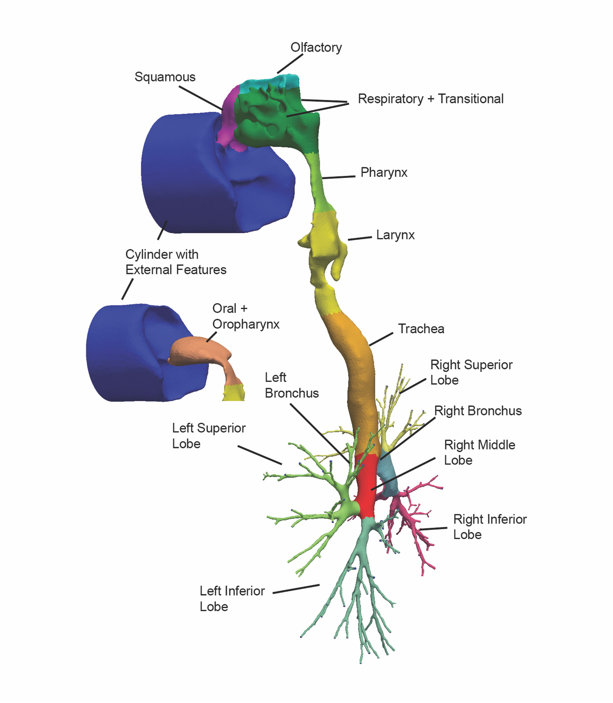
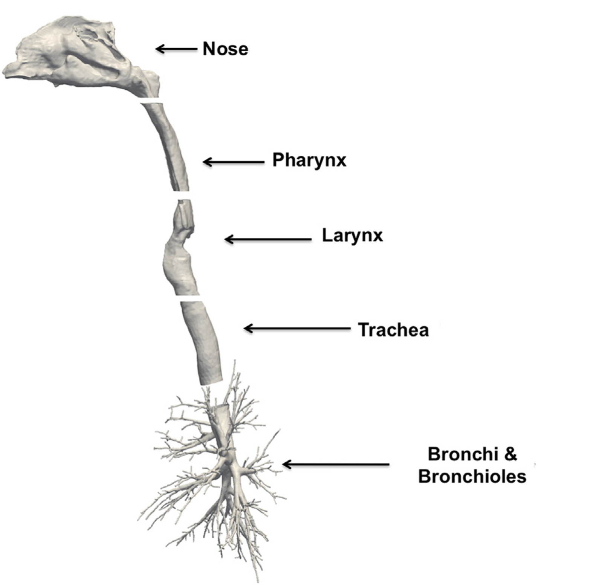
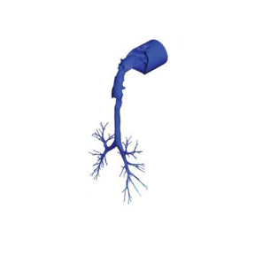
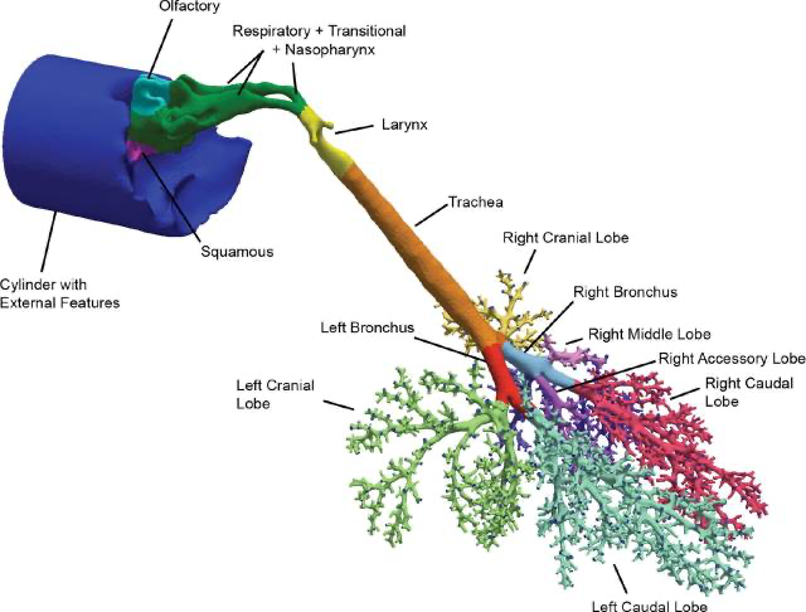

# iLADDER

#### **In-silico LADDER: Lung Aerosol Dosimetry for Drug and Environmental Research**

**This project is also available on [SimTK](https://simtk.org/projects/insilico_ladder).** 

The development of predictive aerosol dosimetry models has been a major focus of environmental toxicology and pharmaceutical health research for decades. Simplified compartmental and one-dimensional models have been successful in predicting overall deposition but fail to accurately predict local deposition. Computational fluid-particle dynamics (CFPD) has been extensively used to study flow patterns and aerosol transport in idealistic, physiologically realistic and more recently patient-specific models of lung airways. To date, the challenge of predicting the deposition of inhaled aerosols under disease conditions is largely unmet. While 3D CFPD models provide the capability of including subject-specific lung abnormalities resulting from respiratory diseases, they typically only include a sub-region of the lung because of the prohibitive computational costs compared to simplified models.

The in-silico LADDER project aims at developing aerosol dosimetry multiscale models through a step-wise, modular integration of 3D computational fluid dynamic airflow and aerosol tracking CT-based lung models that extend from the nose and mouth to several generations of the conducting airways with each most distal 3D pulmonary airway bi-directionally coupled with lower dimensional airflow, aerosol transport, and tissue mechanics models to describe aerosol transport and deposition over the full respiratory system. The expected deliverables will be a suite of modular, multiscale models and standardized approaches for new model development that can be used by researchers, risk assessors, or clinicians to predict aerosol deposition in the lungs under healthy and disease conditions in addition to the underlying algorithms and framework for effective linking of user-defined, personalized aerosol dosimetry models in the future. As modules are fully validated and published, they will be made available to the research community on this platform. 

**This project is funded by grant U01-ES028669 from the National Institutes of Health (NIH). The curation of lung models and meshes is funded by the Environmental Protection Agency (EPA) through service agreement 68HE0B22P0365.**

### Available Lung Models

Detailed metadata  and information for each model is available below this table:

| Sample ID and STL                                            | Basic Info                     | Species | Mesh                                                         | Reference                                                    | Model                                                        |
| ------------------------------------------------------------ | ------------------------------ | ------- | ------------------------------------------------------------ | ------------------------------------------------------------ | ------------------------------------------------------------ |
| [human01](human01/)                                          | female, 84 yrs                 | Human   | Yes [Nasal](https://drive.google.com/file/d/1imDkstz6MvFbS1XG7UXyt2q_zp3NRwv8/view?usp=sharing) [Oral](https://drive.google.com/file/d/1nz_A50ESgGO3gGnRCjxlU-0ZCBnzm8CN/view?usp=sharing) | [Corley et al., 2012](https://doi.org/10.1093/toxsci/kfs168); [Corley et al., 2015](https://doi.org/10.1093/toxsci/kfv071) |  |
| [human02.2016](https://drive.google.com/file/d/1CxhNb389b_hMd4hZ-GEovwC3JzM-6Da8/view?usp=sharing) | male, 35 yrs, 68kg, 170cm tall | Human   | [Yes](https://drive.google.com/file/d/1LOwf5gm25sJ1cX29KKJ3GiiDzha4XMav/view?usp=sharing) | [Kabilan et al., 2016](https://doi.org/10.1016/j.jaerosci.2016.01.011) |  |
| [human02.2021](human02.2021/)                                | male, 35 yrs, 68kg, 170cm tall | Human   | [Yes](https://drive.google.com/file/d/1LOwf5gm25sJ1cX29KKJ3GiiDzha4XMav/view?usp=sharing) | [Corley et al., 2021](https://doi.org/10.1093/toxsci/kfab062) |                                                              |
| [human03](human03/)                                          | male, 18 yrs, 74kg             | Human   | [Yes](https://drive.google.com/file/d/1AU6V0V2sPjrHRY7ZEx9yAmSDR2nz_Pla/view?usp=sharing) | [Corley et al., 2015](https://doi.org/10.1093/toxsci/kfv071) |  |
| [monkey01](monkey01/)                                        | male, 6 months                 | Monkey  | [Yes](https://drive.google.com/file/d/17Wy2Yqs-3d-9JfDlDnKDyqF4Q1-bwhVm/view?usp=sharing) | [Corley et al.  2012](https://academic.oup.com/toxsci/article/128/2/500/1649982) |                              |
| [rat01](rat01/)                                              | male, 9-10 weeks, 300  g       | Rat     |                                                              | [Corley et al., 2012](https://doi.org/10.1093/toxsci/kfs168) [Corley et al., 2015](https://doi.org/10.1093/toxsci/kfv071) |                                                              |
| [rat02](rat02/)                                              | male, 9-10 weeks, 300  g       | Rat     |                                                              | [Corley et al., 2012](https://doi.org/10.1093/toxsci/kfs168) [Corley et al., 2015](https://doi.org/10.1093/toxsci/kfv071) [Corley et al., 2021](https://doi.org/10.1093/toxsci/kfab062) |                                                              |
| rabbit01                                                     | male, 3-3.7 kg,                | Rabbit  |                                                              | [Kabilan et al., 2016](https://doi.org/10.1016/j.jaerosci.2016.01.011) |                                                              |
| rabbit02                                                     | female,  5-6 months, 4-5 kg    | Rabbit  |                                                              | [Corley et al., 2008](https://doi.org/10.1080/08958370802598005) |                                                              |

### Meta Data

| Sample ID    | Additional Info                                              |
| ------------ | ------------------------------------------------------------ |
| human01      | **<u>Human</u>** (female, 84 Yr-old)  **<u>Imaging</u>**: multi-slice CT imaging of the head and torso (623-μm isotropic resolution, FOV 31.9 × 31.9 × 46.1 cm, i.e., image volume size of 512 × 512 × 739).   **<u>Segmentation</u>**: based on intensity thresholding followed by visual validation and repair.  **<u>Model</u>**: upper airways (nasal passages or oral cavity, both available) down to several generations of conducting airways (135 outlets). A cylinder capturing the contours of the face and extending several centimeters away from the face is included with the distal end of the cylinder used to initiate airflows and chemical exposures.   **<u>Mesh</u>**: polyhedral mesh created in OpenFOAM **<u>Simulation types</u>**: airflow, vapor exposure **<u>Funding source</u>:** NHLBI R01 HL073598 and NIEHS P01 ES011617 **<u>Related Publications</u>:** [Corley et al., 2012](https://doi.org/10.1093/toxsci/kfs168); [Corley et al., 2015](https://doi.org/10.1093/toxsci/kfv071) |
| human02.2016 | **<u>Human</u>** (male, 35 Yr-old, 68 kg, 1.70 m tall) **<u>Imaging</u>**: multi-slice CT imaging of the head and torso (0.5 x 0.7 x 0.7 mm resolution, FOV 36 × 36 × 48 cm, i.e., image volume size of 512 × 512 × 960).  **<u>Segmentation</u>**: based on intensity thresholding followed by visual validation and repair. Larynx was widened from the as-imaged supine breath-hold position to a fully open geometry to mimic inhalation in an upright posture.  **<u>Model</u>**: Nose down to several generations of conducting airways (272 outlets). Model is provided in 5 stl files as listed in the figure. **<u>Mesh</u>**: Hybrid prism/polyhedral volume meshes generated in STARCCM+ (Version 8.02, 5,751,626 nodes and 2,550,285 polyhedral elements) **<u>Simulation types</u>**: airflow and aerosol transportFunding: NHLBI R01HL073598 **<u>Related publications</u>**: [Kabilan et al., 2016](https://doi.org/10.1016/j.jaerosci.2016.01.011) |
| human02.2021 | **<u>Human</u>** (male, 35 Yr-old, 68 kg, 1.70 m tall) **<u>Imaging</u>**: multi-slice CT imaging of the head and torso (0.5 x 0.7 x 0.7 mm resolution, FOV 36 × 36 × 48 cm, i.e., image volume size of 512 × 512 × 960).  **<u>Segmentation</u>**: based on intensity thresholding followed by visual validation and repair. In Kabilan et al’s study (2016), the larynx was widened from the as-imaged supine breath-hold position to a fully open geometry to mimic inhalation in an upright posture. Additional modifications of the oral cavity, i.e., repositioning surface of the tongue for upright oral breathing and closing off the connection to the esophagus, were made in the model used in Corley et al.’s study (2021).  **<u>Models</u>**: 1) Oral cavity down to several generations of conducting airways (272 outlets). Model is provided in 5 stl files; 2) Nose down to trachea. Model is provided in 4 stl files. **Mesh**: Hybrid prism/polyhedral volume meshes generated in STARCCM+ (Version 8.02 for the nasal breathing model (2.85 million elements) and version 14.04.011 for the oral breathing model (4.88 million elements)). Detailed computational mesh characteristics can be found in Table 1 of Corley et al (2021) **<u>Simulation types</u>**: airflow and aerosol transport Funding: NHLBI R01HL073598 and NIEHS U01 ES028669 **<u>Related publications</u>**: [Corley et al., 2021](https://doi.org/10.1093/toxsci/kfab062) |
| human03      | **<u>Human</u>** (male, 18 Yr-old, 72 kg) **<u>Imaging</u>**: multi-slice CT imaging of the head and torso. **<u>Segmentation</u>**: based on intensity thresholding followed by visual validation and repair. **<u>Model</u>**: Oral cavity down to several generations of conducting airways (8 ± 4 airway generations, 117 outlets). A cylinder capturing the contours of the face and extending several centimeters away from the face is included with the distal end of the cylinder used to initiate airflows and chemical exposures.  **<u>Mesh</u>**: polyhedral mesh created in OpenFOAM (782,000 elements, 442,000 nodes, and 181,000 surface facets, each with their anatomically defined PBPK model boundary condition) **<u>Simulation types</u>**: airflow, vapor exposure **<u>Funding</u>**: NHLBI R01 HL073598 **<u>Related publications</u>**: [Corley et al., 2015](https://doi.org/10.1093/toxsci/kfv071) |
| monkey01     | **<u>Species</u>**: Monkey (Rhesus, male, 6-month-old, 1.3 kg) **<u>Imaging</u>**: postmortem CT imaging (GE HighSpeed FX/i system) of the upper airways (nose trough larynx, 1 mm-thick continuous slices) and MR imaging (2T Varian Unity Plus MRI spectrometer) of silicone cast of the trachea and lung obtained at a lung pressure 30 cm H2O from same animal and submersed in 0.25% agar containing the contrast agent Magnevist (1:500 v/v; 391-μm isotropic resolution, FOV 10.1 cm x 10.1 cm x 10.1 cm).  **<u>Segmentation</u>**: upper airways segmentation based on intensity thresholding followed by visual validation and repair. Prefiltering of airway cast images using background normalization and edge-preserving hybrid median filters to remove both low- and high-frequency noise, respectively, followed by semiautomatic segmentation, and manual evaluation and repair when necessary. **<u>Model</u>**: upper airways (nasal passages) down to several generations of conducting airways (airway diameter cut-off of 650 µm resulting in 2172 outlets). A cylinder capturing the contours of the face and extending several centimeters away from the face is included with the distal end of the cylinder used to initiate airflows and chemical exposures.  **<u>Mesh</u>**: polyhedral mesh created in OpenFOAM, with each boundary facet assigned to a non-overlapping region for CFD/PBPK simulations. **<u>Simulation types</u>**: airflow, vapor exposure **<u>Funding</u>**: NHLBI R01 HL073598 and NIEHS P01 ES011617 **<u>Related publications</u>**: [Corley et al., 2012](https://doi.org/10.1093/toxsci/kfs168) |
| rat01        | **<u>Rat</u>** (male, 9-10 weeks, 300  g) **<u>Related publications</u>**: [Corley et al., 2012](https://doi.org/10.1093/toxsci/kfs168); [Corley et al., 2015](https://doi.org/10.1093/toxsci/kfv071) |
| rat02        | **<u>Rat</u>** (male, 9-10 weeks, 300  g) **<u>Related publications</u>**: [Corley et al., 2012](https://doi.org/10.1093/toxsci/kfs168); [Corley et al., 2015](https://doi.org/10.1093/toxsci/kfv071); [Corley et al., 2021](https://doi.org/10.1093/toxsci/kfab062) |
| rabbit01     | **<u>Rabbit</u>** (male, 3-3.7 kg)                           |
| rabbit02     | **<u>Rabbit</u>** (female,  5-6 months, 4-5 kg)              |

### References

Corley, R. A., Kabilan, S., Kuprat, A. P., Carson, J. P., Jacob, R. E., Minard, K. R., Teeguarden, J. G., Timchalk, C., Pipavath, S., Glenny, R., & Einstein, D. R. (2015). Comparative Risks of Aldehyde Constituents in Cigarette Smoke Using Transient Computational Fluid Dynamics/Physiologically Based Pharmacokinetic Models of the Rat and Human Respiratory Tracts. *Toxicological Sciences: An Official Journal of the Society of Toxicology*, *146*(1), 65–88.

Corley, R. A., Kabilan, S., Kuprat, A. P., Carson, J. P., Minard, K. R., Jacob, R. E., Timchalk, C., Glenny, R., Pipavath, S., Cox, T., Wallis, C. D., Larson, R. F., Fanucchi, M. V., Postlethwait, E. M., & Einstein, D. R. (2012). Comparative computational modeling of airflows and vapor dosimetry in the respiratory tracts of rat, monkey, and human. *Toxicological Sciences: An Official Journal of the Society of Toxicology*, *128*(2), 500–516.

Corley, R. A., Kuprat, A. P., Suffield, S. R., Kabilan, S., Hinderliter, P. M., Yugulis, K., & Ramanarayanan, T. S. (2021). New Approach Methodology for Assessing Inhalation Risks of a Contact Respiratory Cytotoxicant: Computational Fluid Dynamics-Based Aerosol Dosimetry Modeling for Cross-Species and In Vitro Comparisons. *Toxicological Sciences: An Official Journal of the Society of Toxicology*, *182*(2), 243–259.

Kabilan, S., Suffield, S. R., Recknagle, K. P., Jacob, R. E., Einstein, D. R., Kuprat, A. P., Carson, J. P., Colby, S. M., Saunders, J. H., Hines, S. A., Teeguarden, J. G., Straub, T. M., Moe, M., Taft, S. C., & Corley, R. A. (2016). Computational fluid dynamics modeling of Bacillus anthracis spore deposition in rabbit and human respiratory airways. *Journal of Aerosol Science*, *99*, 64–77.