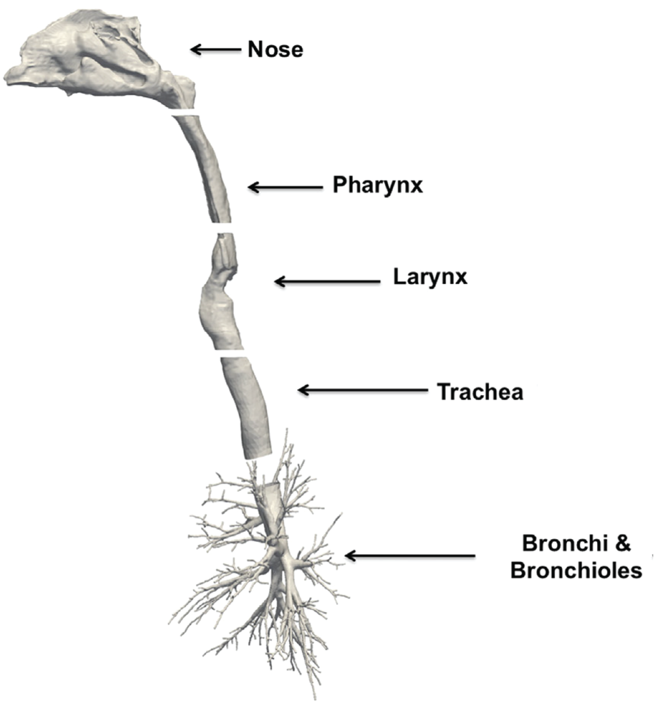

### Human02.2016

[Access STL](https://drive.google.com/file/d/1CxhNb389b_hMd4hZ-GEovwC3JzM-6Da8/view?usp=sharing)

**<u>Human</u>** (male, 35 Yr-old, 68 kg, 1.70 m tall) **<u>Imaging</u>**: multi-slice CT imaging of the head and torso (0.5 x 0.7 x 0.7 mm resolution, FOV 36 × 36 × 48 cm, i.e., image volume size of 512 × 512 × 960).  **<u>Segmentation</u>**: based on intensity thresholding followed by visual validation and repair. Larynx was widened from the as-imaged supine breath-hold position to a fully open geometry to mimic inhalation in an upright posture.  **<u>Model</u>**: Nose down to several generations of conducting airways (272 outlets). Model is provided in 5 stl files as listed in the figure. **<u>Mesh</u>**: Hybrid prism/polyhedral volume meshes generated in STAR-CCM+ (Version 8.02, 5,751,626 nodes and 2,550,285 polyhedral elements) **<u>Simulation types</u>**: airflow and aerosol transport <u>**Simulation parameters:**</u> minute volume = 7.4 L/min, 20 breaths/min, spore size (MMAD ± GSD): 1.12 ± 1.31 µm  **<u>Funding</u>:** NHLBI R01HL073598 **<u>Related publications</u>**: [Kabilan et al., 2016](https://doi.org/10.1016/j.jaerosci.2016.01.011)

