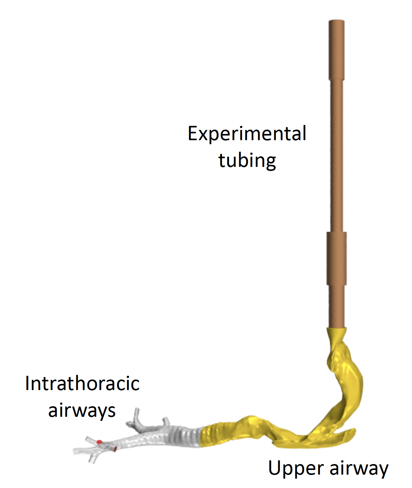

## Human02.2023

**<u>Human</u>** (male, 35 Yr-old, 68 kg, 1.70 m tall)  **<u>Imaging</u>** multi-slice CT imaging of the head and torso (0.5 x 0.7 x 0.7 mm resolution, FOV 36 × 36 × 48 cm, i.e., image volume size of 512 × 512 × 960). 
 **<u>Segmentation:</u>** based on intensity thresholding followed by visual validation and repair. See [Kuprat et al., 2021](https://doi.org/10.1016/j.jaerosci.2020.105647) for detailed description of segmentation.
 **<u>Models:</u>** Oral cavity down to ~3 generations of conducting airways (11 outlets). Model also include experimental tubing between the particle counter and mouth.
 **<u>Mesh:</u>** Hybrid prism/polyhedral volume meshes generated in STAR-CCM+ (~12 million elements).
 **<u>Simulation parameters:</u>** tidal volume = ~1,000ml, flow rates = ~0.3 and ~0.75L/s, particle size: 1and 2.9 µm 
 **<u>Simulation types:</u>** airflow and aerosol transport 
<u>**Funding:**</u> NIEHS U01 ES028669 
 **<u>Related publications:</u>** [Kuprat et al., 2023](https://doi.org/10.1016/j.jaerosci.2023.106233)

<<<<<<< HEAD
**<u>Related publications:</u>** [Kuprat et al., 2023](https://doi.org/10.1016/j.jaerosci.2023.106233)

	
=======
