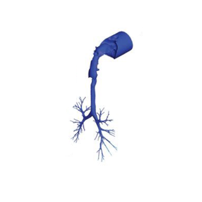

### Human03

**<u>Human</u>** (male, 18 Yr-old, 72 kg) **<u>Imaging</u>**: multi-slice CT imaging of the head and torso. **<u>Segmentation</u>**: based on intensity thresholding followed by visual validation and repair. **<u>Model</u>**: Oral cavity down to several generations of conducting airways (8 ± 4 airway generations, 117 outlets). A cylinder capturing the contours of the face and extending several centimeters away from the face is included with the distal end of the cylinder used to initiate airflows and chemical exposures.  **<u>Mesh</u>**: polyhedral mesh created in OpenFOAM (782,000 elements, 442,000 nodes, and 181,000 surface facets, each with their anatomically defined PBPK model boundary condition) **<u>Simulation types</u>**: airflow, vapor exposure <u>**Simulation parameters:**</u> puff breathing profile for flow, initial concentration in oral cavity: 94 ppm (acrolein), 1028 ppm (acetaldehyde), 108 ppm (formaldehyde). **<u>Funding</u>**: NHLBI R01 HL073598 **<u>Related publications</u>**: [Corley et al., 2015](https://doi.org/10.1093/toxsci/kfv071)

