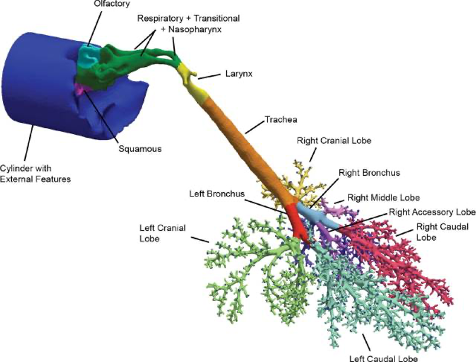

### Monkey01

**<u>Species</u>**: Monkey (Rhesus, male, 6-month-old, 1.3 kg)

**<u>Imaging</u>**: postmortem CT imaging (GE HighSpeed FX/i system) of the upper airways (nose trough larynx, 1 mm-thick continuous slices) and MR imaging (2T Varian Unity Plus MRI spectrometer) of silicone cast of the trachea and lung obtained at a lung pressure 30 cm H2O from same animal and submersed in 0.25% agar containing the contrast agent Magnevist (1:500 v/v; 391-μm isotropic resolution, FOV 10.1 cm x 10.1 cm x 10.1 cm). 

**<u>Segmentation</u>**: upper airways segmentation based on intensity thresholding followed by visual validation and repair. Prefiltering of airway cast images using background normalization and edge-preserving hybrid median filters to remove both low- and high-frequency noise, respectively, followed by semiautomatic segmentation, and manual evaluation and repair when necessary.

**<u>Model</u>**: upper airways (nasal passages) down to several generations of conducting airways (airway diameter cut-off of 650 µm resulting in 2172 outlets). A cylinder capturing the contours of the face and extending several centimeters away from the face is included with the distal end of the cylinder used to initiate airflows and chemical exposures. 

**<u>Mesh</u>**: polyhedral mesh created in OpenFOAM, with each boundary facet assigned to a non-overlapping region for CFD/PBPK simulations.

**<u>Simulation types</u>**: airflow, vapor exposure

**<u>Funding</u>**: NHLBI R01 HL073598 and NIEHS P01 ES011617

**<u>Related publications</u>**: Corley et al., 2012 (https://doi.org/10.1093/toxsci/kfs168)

