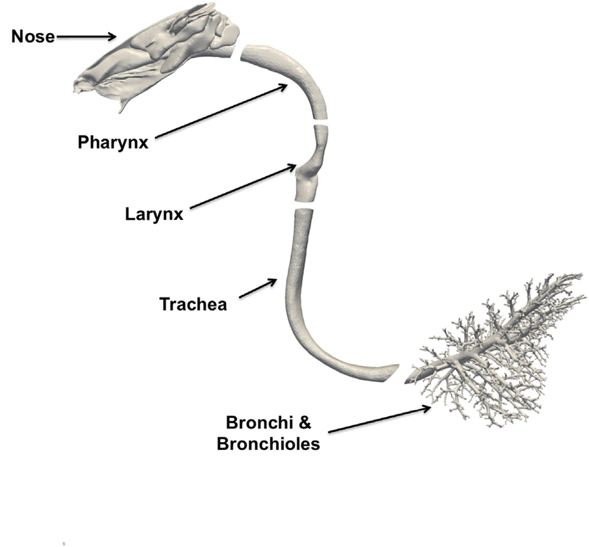

### Rabbit02

**<u>Species</u>**: Rabbit (New Zealand White, male, 3.5-3.8 kg) **<u>Imaging</u>**: µCT imaging (GE eXplorer CT-120) at 50 µm resolution: postmortem in-situ imaging of the upper airways (nose trough larynx) followed by imaging of silicone cast of the trachea down to bronchiolar airways.  **<u>Segmentation</u>**: upper airways segmentation based on intensity thresholding followed by visual validation and repair. Prefiltering of airway cast images using background normalization and edge-preserving hybrid median filters to remove both low- and high-frequency noise, respectively, followed by semiautomatic segmentation, and manual evaluation and repair when necessary. **<u>Model</u>**: upper airways (nasal passages) down to several generations of conducting airways (airway diameter cut-off of 500 µm resulting in 3857 airways with 2878 terminal outlets).  **<u>Mesh</u>**: Hybrid prism/polyhedral volume meshes generated in STAR-CCM+ (Version 8.02, 36,232,173 nodes and 16,060,891 polyhedral elements). **<u>Simulation types</u>**: airflow and aerosol transport <u>**Simulation parameters:**</u> minute volume = 1.745 L/min, 80 breaths/min, spore size (MMAD ± GSD): 1.12 ± 1.31 µm and 0.92 ± 1.57 µm **<u>Funding</u>**: NHLBI R01 HL073598 **<u>Related publications</u>**: [Kabilan et al., 2016](http://dx.doi.org/10.1016/j.jaerosci.2016.01.011)

