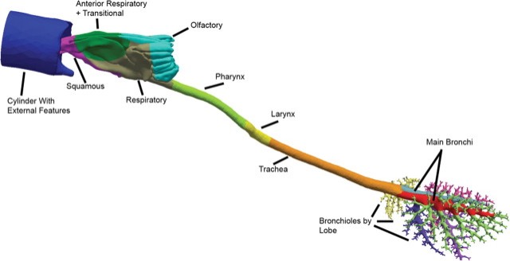

### Rat1.2012

**<u>Species:</u>** Rat (Sprague Dawley, male, 9-10-week-old, ~300 g) **<u>Imaging:</u>** postmortem MR imaging (Unity Plus spectrometer (Varian, Palo Alto, CA) and a commercial imaging probe (Doty Scientific, Columbia, SC) mounted inside a 7-T, 89-mm diameter, vertical-bore magnet (Oxford Instruments, Oxford, UK)) of the upper airways (nose trough larynx, 125 µm resolution) and µCT imaging (Skyscan 1176 μCT, Microphotonics, Inc., Allentown, PA) of silicone cast of the trachea down to bronchiolar airways at 18-μm isotropic resolution.  **<u>Segmentation:</u>** upper airways segmentation based on intensity thresholding followed by visual validation and repair. Prefiltering of airway cast images using background normalization and edge-preserving hybrid median filters to remove both low- and high-frequency noise, respectively, followed by semiautomatic segmentation, and manual evaluation and repair when necessary. **<u>Model:</u>** upper airways (nasal passages) down to several generations of conducting airways (airway diameter cut-off of 180 µm resulting in 1272 outlets). A cylinder capturing the contours of the face and extending several centimeters away from the face is included with the distal end of the cylinder used to initiate airflows and chemical exposures. **<u>Mesh:</u>** polyhedral mesh created in OpenFOAM, with each boundary facet assigned to a non-overlapping region for CFD/PBPK simulations (1.86 million elements with 10.5 million nodes and 0.63 million surface facets). **<u>Simulation types:</u>** airflow, vapor exposure **<u>Simulation parameters:</u>** minute volume = 0.217 L/min, acrolein concentration at inlet: 0.6 to 9.1 ppm **<u>Funding</u>**: NHLBI R01 HL073598 and NIEHS P01 ES011617 **<u>Related publications</u>**: [Corley et al., 2012](https://doi.org/10.1093/toxsci/kfs168)

